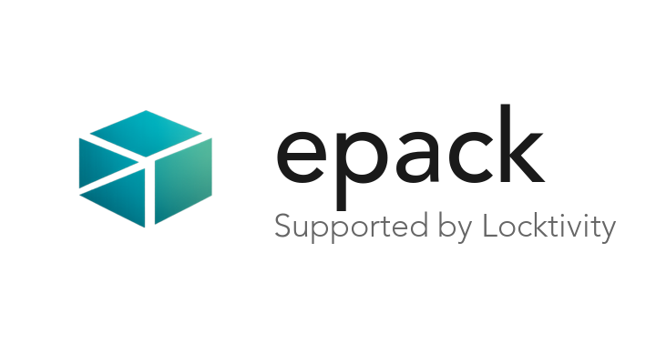

<p align="center">
  
</p>

<p align="center">
  <a href="https://epack.dev"><strong>epack.dev</strong></a>
</p>

<p align="center">
  <a href="https://github.com/locktivity/epack/actions/workflows/ci.yaml"></a>
  <a href="https://goreportcard.com/report/github.com/locktivity/epack"></a>
  <a href="LICENSE"></a>
</p>

**epack** is a CLI for creating, signing, and verifying **Evidence Packs**, cryptographically sealed bundles of compliance evidence. Collect security posture from cloud providers, identity systems, and SaaS tools. Sign with Sigstore. Share verifiable evidence with auditors and customers.

<p align="center">
  
</p>

## Why epack?

| Problem | epack Solution |
|---------|----------------|
| Evidence scattered across tools | Bundle everything into one portable pack |
| "Trust me" screenshots | Cryptographic signatures prove who collected what, when |
| Manual evidence collection | Automated collectors gather evidence from APIs |
| Comparing audit periods | `epack diff` shows exactly what changed |
| Sharing evidence securely | Push to registries, pull with verification |

## Install

```bash
# Homebrew (macOS/Linux)
brew install locktivity/tap/epack

# Go
go install -tags components github.com/locktivity/epack/cmd/epack@v0.1.23

# Binary releases (with SLSA Level 3 provenance)
# → github.com/locktivity/epack/releases
```

## Quick Start

**Option A: Build from files you already have**

```bash
epack build evidence.epack ./reports/*.json --stream myorg/security
epack sign evidence.epack
epack verify evidence.epack
```

**Option B: Automated collection pipeline**

```bash
epack new my-pipeline && cd my-pipeline
# Edit epack.yaml to add collectors (GitHub, AWS, Okta, etc.)
export GITHUB_TOKEN=ghp_...
epack collect          # Lock deps → sync binaries → run collectors → build pack
epack sign *.epack
```

## Core Commands

| Command | What it does |
|---------|--------------|
| `epack build` | Create a pack from files |
| `epack sign` | Sign with Sigstore (keyless or key-based) |
| `epack verify` | Verify integrity and signatures |
| `epack inspect` | Show pack contents and metadata |
| `epack diff` | Compare two packs (what changed?) |
| `epack collect` | Run collectors and build a pack |

## What's in a Pack?

```
evidence.epack/
├── manifest.json           # Metadata + SHA-256 digests
├── artifacts/              # Your evidence files
│   ├── github-posture.json
│   ├── aws-config.json
│   └── soc2-report.pdf
└── attestations/           # Sigstore signatures
    └── manifest.json.sigstore.json
```

## Components

epack is extensible through a component system:

| Component | Purpose | Scope | Example |
|-----------|---------|-------|---------|
| **Collectors** | Gather evidence from APIs | Project | `epack-collector-github` |
| **Tools** | Analyze pack contents | Project | `epack-tool-policy` |
| **Remotes** | Push/pull to registries | Project | `epack-remote-s3` |
| **Utilities** | Standalone helper apps | User | `epack-util-viewer` |

```bash
# Search the catalog
epack catalog search github

# Install a collector (project-scoped)
epack install collector github

# Install a utility (user-scoped, global)
epack utility install viewer

# Run an installed utility
epack utility viewer evidence.epack
```

## When to Use epack

**Good fit:**
- Multi-source evidence collection (GitHub + AWS + Okta + ...)
- Audit trails requiring cryptographic proof
- Sharing evidence between organizations
- Comparing security posture over time
- CI/CD evidence pipelines

**Consider alternatives if:**
- Simple file archiving (use tar/zip)
- Real-time monitoring (use observability tools)
- Single-file attestations (use cosign directly)

## Two Binaries, Two Security Profiles

| Variant | Use Case |
|---------|----------|
| `epack` | Full features: collectors, tools, remotes, utilities |
| `epack-core` | Pack operations only (no subprocess execution) |

Use `epack-core` for verification-only workflows (CI, auditors) where you don't need component orchestration.

## Documentation

**Getting Started**
- [Quickstart Guide](docs/quickstart.md)
- [Concepts](docs/concepts.md)

**User Guides**
- [Hardening Guide](docs/hardening.md)

**Reference**
- [CLI Reference](https://epack.dev/reference/cli)
- [Configuration](https://epack.dev/reference/config)

**For Component Authors**
- [Collector Protocol](docs/collect-protocol.md)
- [Tool Protocol](docs/tool-protocol.md)
- [Remote Protocol](docs/remote-protocol.md)
- [Component Requirements](docs/component-rules.md)

**Security**
- [Threat Model](docs/threat-model.md)
- [Architecture](docs/architecture.md)
- [Security Policy](SECURITY.md)

**Specification**
- [Evidence Pack Format](https://evidencepack.org/spec)

## Library Usage

```go
import (
    "github.com/locktivity/epack/pack"
    "github.com/locktivity/epack/pack/builder"
)

// Build
b := builder.New("myorg/stream")
b.AddFile("./config.json")
b.Build("evidence.epack")

// Read and verify
p, _ := pack.Open("evidence.epack")
defer p.Close()
p.VerifyIntegrity()
```

[Full API documentation →](https://pkg.go.dev/github.com/locktivity/epack)

## Contributing

```bash
git clone https://github.com/locktivity/epack.git
cd epack
make test-all
```

See [CONTRIBUTING.md](CONTRIBUTING.md) for development setup and guidelines.

## License

Apache License 2.0


**Built by Locktivity**

[Locktivity](https://locktivity.com) builds tools for third-party security. We're developing epack in the open because portable, verifiable security evidence is a problem bigger than any one vendor.
